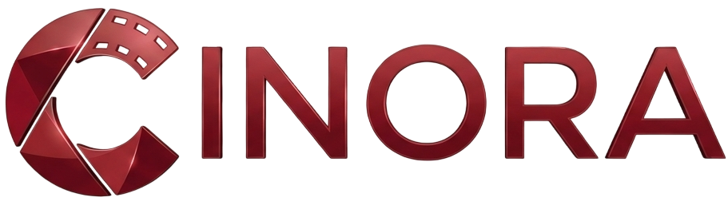

<div align="center">
  
  <h1>Cinora</h1>
  <p><strong>A Modern AI-Powered Streaming Platform & Tracker</strong></p>
</div>

<br />


Cinora is a robust, full-stack streaming platform and movie tracking application built with the modern Next.js App Router. It seamlessly aggregates content from external APIs (TMDB, Kinopoisk), provides an embedded multi-source player, and features advanced AI-driven recommendations based on user watch history and preferences.

🇷🇺 **[Читайте простое руководство на русском языке: Как работает Cinora под капотом](.ai-docs/how-it-works-ru.md)**

## ✨ Features

- 🎬 **Multi-Source Video Player**: Aggregates multiple video CDNs to ensure content is always available.
- 🤖 **AI-Driven Recommendations**: Personalized content suggestions based on user watch history and likes.
- 📺 **TV Mode**: A specialized, remote-friendly interface for Smart TVs with secure code-based authentication.
- 🔐 **Authentication**: Secure credential-based login powered by NextAuth.js.
- 📊 **Comprehensive Admin Panel**: Content management, mass import tools, database cleanup, and user analytics.
- 📱 **Fully Responsive**: Beautiful, glassmorphic UI optimized for desktop, tablet, and mobile.
- 💾 **Automated Cron Jobs**: Nightly content synchronization, broken link detection, and database optimization.

## 🛠 Tech Stack

- **Framework**: [Next.js 14](https://nextjs.org/) (App Router, Server Actions)
- **Language**: [TypeScript](https://www.typescriptlang.org/)
- **Styling**: [Tailwind CSS](https://tailwindcss.com/) with Lucide Icons
- **Database**: [Prisma ORM](https://www.prisma.io/) (SQLite for dev, PostgreSQL ready)
- **Authentication**: [NextAuth.js](https://next-auth.js.org/)
- **Caching**: Redis (Optional)

## 🚀 Getting Started

### Prerequisites

- Node.js 18+ 
- npm or yarn
- TMDB API Key & Kinopoisk API Key

### Installation

1. **Clone the repository:**
   ```bash
   git clone https://github.com/f0xyyyk1ddd/cinora.git
   cd cinora
   ```

2. **Install dependencies:**
   ```bash
   npm install
   ```

3. **Environment Setup:**
   Create a `.env` file in the root directory based on `.env.example`:
   ```env
   NEXTAUTH_URL=http://localhost:3000
   NEXTAUTH_SECRET=your_secret_key
   DATABASE_URL="file:./dev.db"
   TMDB_API_KEY=your_tmdb_key
   KINOPOISK_API_KEY=your_kinopoisk_key
   ```

4. **Database Migration:**
   ```bash
   npx prisma generate
   npx prisma db push
   ```

5. **Start Development Server:**
   ```bash
   npm run dev
   ```
   Open [http://localhost:3000](http://localhost:3000) to view the application.

## 📁 Project Structure

- `/src/app` - Next.js App Router pages and API routes
- `/src/components` - Reusable React UI components
- `/src/lib` - Utility functions, API wrappers, and Prisma client
- `/.ai-docs` - AI context, architecture, and roadmap for LLM-assisted development
- `/prisma` - Database schema and migrations
- `/scripts` - Standalone utility scripts for maintenance

## 🐳 Docker Deployment

Cinora is fully containerized. To deploy to production:

```bash
docker-compose up -d --build
```

## 🤝 Contributing

This project is actively maintained. See the `.ai-docs/roadmap.md` file for the current development roadmap and upcoming features.

## 📄 License

This project is proprietary and confidential. Unauthorized copying of this project, via any medium, is strictly prohibited.
